# EcoGeoGuard 🌿🚨

### A Dual Approach to Environmental Safety and Crop Yield


---

## 📌 Overview

EcoGeoGuard is an AI + IoT based environmental monitoring platform designed to solve multiple rural challenges through one integrated ecosystem.

The system helps in:

- Predicting **landslides**
- Monitoring environmental conditions
- Providing **smart farming recommendations**
- Tracking livestock using geo-fencing
- Sending real-time emergency alerts

This project was developed as a **Capstone Thesis Project** at Lovely Professional University.

---

## Problem Statement

Rural and mountainous areas often face:

- Landslides
- Soil erosion
- Unpredictable rainfall
- Crop failures
- Livestock loss

Existing systems solve these problems separately.

EcoGeoGuard combines everything into **one intelligent platform**.

---

## Features

### Landslide Detection
- MEMS Accelerometer
- Geophone
- Tilt Sensors
- Soil Moisture Sensors
- Weather Monitoring

### Smart Agriculture
- Irrigation recommendations
- Fertilizer guidance
- Weather alerts
- Crop management suggestions

### Livestock Protection
- GPS tracking
- Geo-fencing alerts
- Movement monitoring

### Real-Time Alerts
- Mobile notifications
- SMS alerts
- Dashboard alerts
- Local buzzer/siren alerts

---


## Tech Stack

### Hardware
- Arduino Uno
- MPU6050 Accelerometer
- Geophone
- Tilt Sensor
- Soil Moisture Sensor
- BME280 Weather Sensor
- GPS Module
- RFID Tags

### Software
- Android Studio
- Kotlin
- Firebase
- AWS IoT Core
- Proteus
- Python
- Scikit-learn

---

## Machine Learning Models

The project uses multiple ML models for prediction:

- Random Forest
- Gradient Boosting
- Linear Regression
- K-Means Clustering

### Model Performance

| Model | Accuracy |
|--------|------------|
| Threshold Logic | 78.4% |
| Linear Regression | 81.6% |
| Random Forest | 91.3% |
| Gradient Boosting | **93.7%** |

Gradient Boosting performed best for landslide prediction.

---

## System Architecture

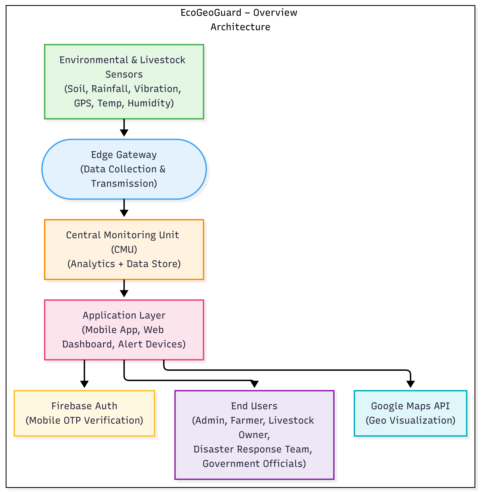

A[Sensors] --> B[Arduino Processing]
B --> C[LoRa / NB-IoT]
C --> D[Cloud Backend]
D --> E[Machine Learning Model]
E --> F[Risk Detection]
F --> G[Mobile App Alerts]
F --> H[SMS Alerts]
F --> I[Dashboard]
```

---

## Project Workflow

1. Collect sensor data  
2. Preprocess data using Arduino  
3. Send data to cloud backend  
4. Run ML prediction models  
5. Generate risk score  
6. Send alerts to users  

---
## App Architecture

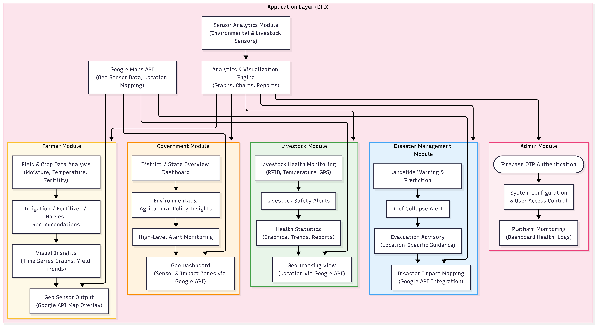

## App Screenshots

### Farmer Dashboard
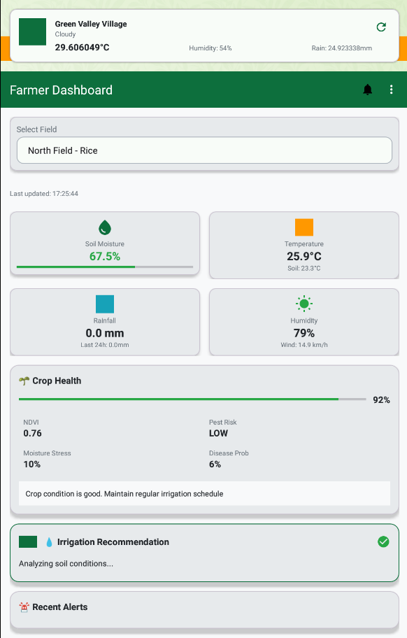

### Disaster Dashboard
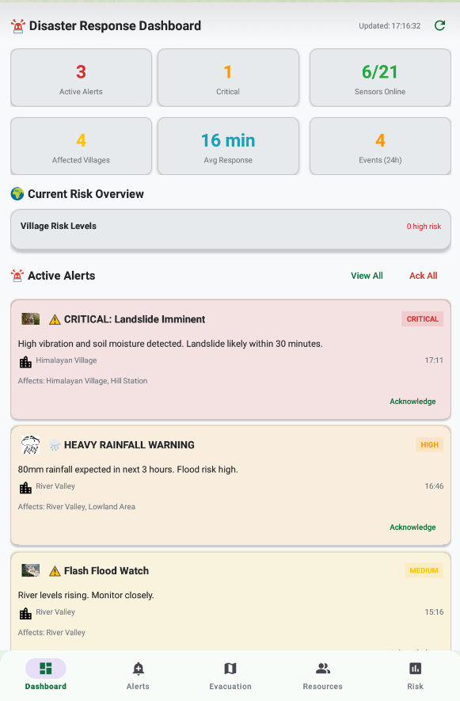
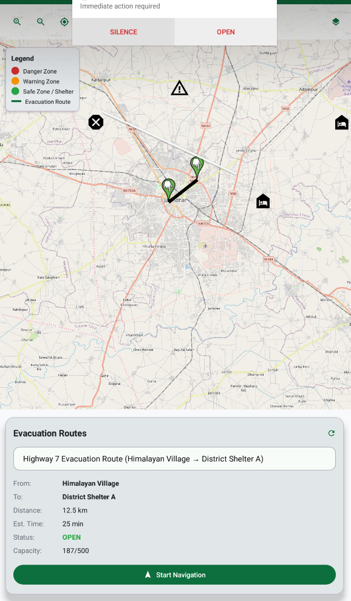
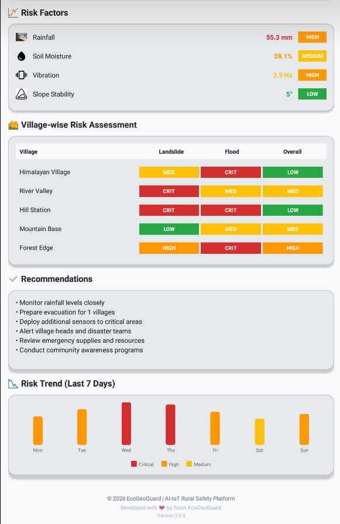

### Admin Dashboard
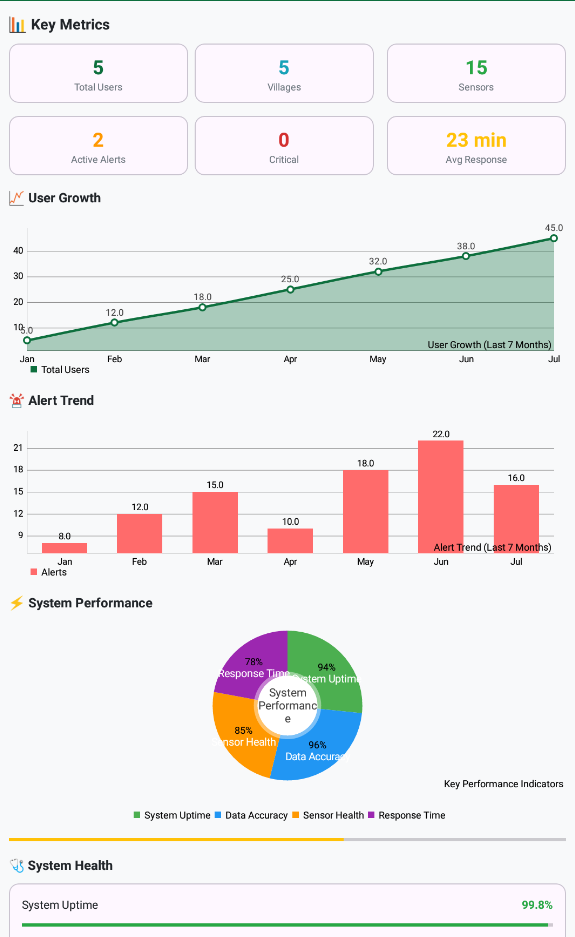
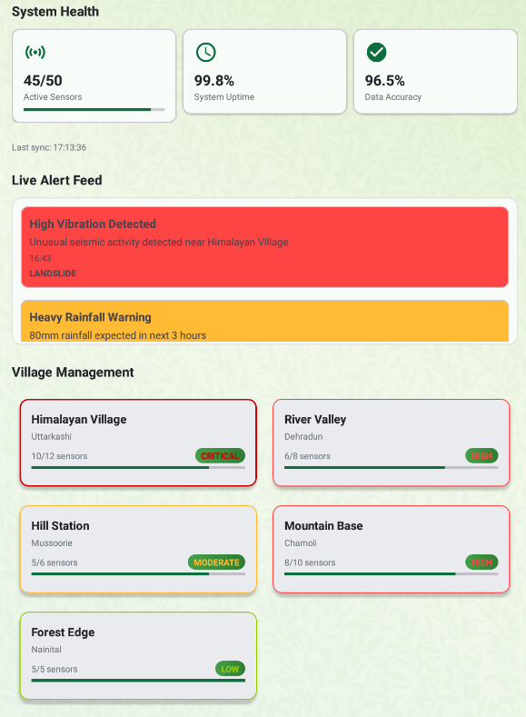

### Livestock Dashboard

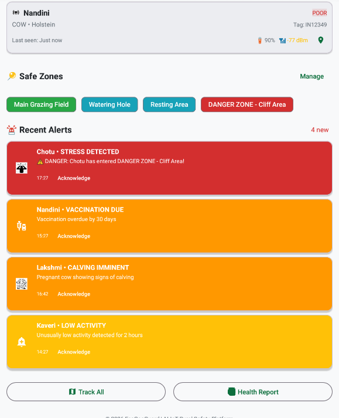
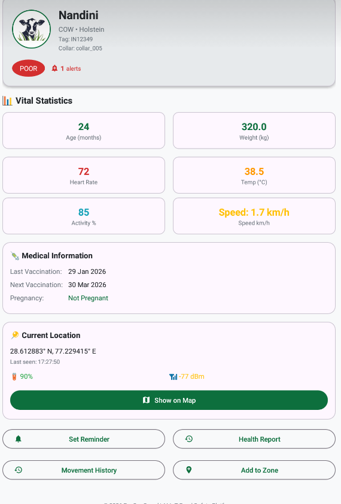

### Government Dashboard

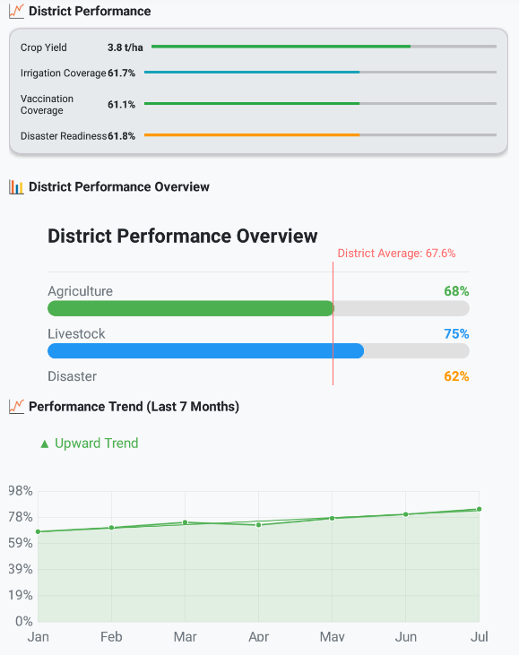
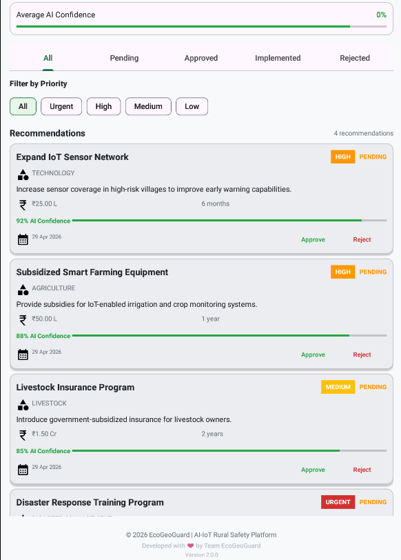


### Proteus Simulation
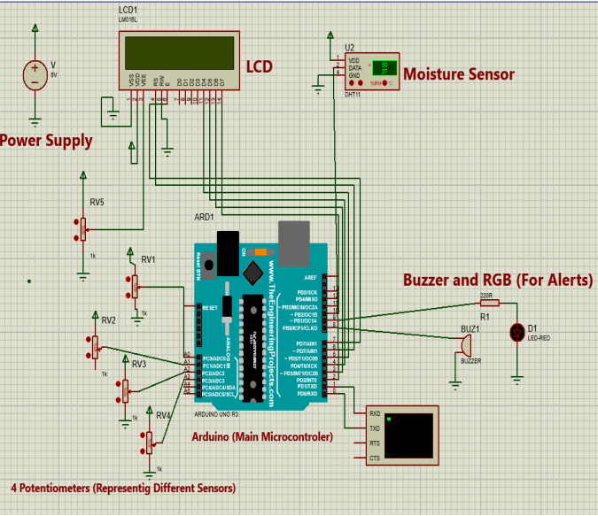

---

## Folder Structure

```bash
EcoGeoGuard/
│
├── app/
├── backend/
├── ml_models/
├── hardware/
├── assets/
│   └── screenshots/
├── README.md
└── thesis-report.pdf
```

---

## Installation

Clone the repository:

```bash
git clone https://github.com/Abhinav1543/EcoGeoGaurd.git
cd EcoGeoGaurd
```

Run Android App:

- Open Android Studio
- Sync dependencies
- Run emulator/device

Setup ML Model:

```bash
pip install -r requirements.txt
```

---

## Future Scope

- Real-world deployment in landslide-prone areas
- Government disaster integration
- Better GPS battery optimization
- Multi-language support
- Offline functionality

---

## Team Members

- Abhinav   
- Parth Shrivastava  
- Radhika  
- Mukul Sharma  
- Mohammad Kavish  

---

## Research Impact

EcoGeoGuard improves traditional landslide monitoring systems by integrating:

✅ Disaster prevention  
✅ Smart agriculture  
✅ Livestock protection  
✅ AI prediction  
✅ Real-time emergency response  

One project. Three real-world problems solved. That's the whole Avengers crossover arc 🌍⚡

---

## License

EcoGeoGuard License

Copyright (c) 2026 EcoGeoGuard Team

This project was developed as part of an academic thesis/capstone project at Lovely Professional University.

Permission is granted to view, fork, and reference this repository for educational and research purposes only.

Restrictions:
- Commercial use is prohibited without explicit permission.
- Redistribution of this project as original work is prohibited.
- Proper credit must be given to the original authors.

This software is provided "as is", without warranty of any kind.
